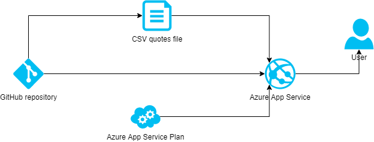

# Quote Finder
A flask web app that finds a quote on any given genre.

## Video

## Dataset
The quotes are pulled from a CSV file obtained from [TheWebMiner](https://thewebminer.com/buy-famous-quotes-database) containing around 76,000 quotes across 117 genres, by over 11,000 authors.

## A quote lookup? Where's the AI?
Since there are only 117 genres in the quote library, if the user asks for a theme that doesn't exist as a label by itself the app will attempt to find the closest match. Sometimes it's good, sometimes not so good!

The closest match is identified by translating the requested genre and all existing genre labels into multi-dimensional vectors and locating the closest using a measure called cosine distance. The vectors were learned from text samples such that similar words have similar vector representations.

## Try the app
[http://quotr-ml.azurewebsites.net](http://quotr-ml.azurewebsites.net)

## Author
Aleem Juma

# Microsoft Azure Scholarship Project Showcasing Challenge
[Link to guidelines](https://docs.google.com/document/d/1p0rplg0ZrIFfBabY1WyhyVOxjVjxMORC3koV00rscAI/edit)

All criteria are fully met for a full 100% score!

### Using Azure for Implementation based on Course Material
The project is hosted in Azure, using an Azure App Service, connected for continuous integration and continuous deployment to [my github repository](https://github.com/scign/quotr).

### Innovation & Creativity
To my knowledge there is no similar service available on the internet. Through extensive Google searching I was unable to locate a quote search engine that uses ML/NLP to find similar topics.

### Project Implementation
The idea is fully implemented.

### Impact & Potential
Communication is a need in all situations. People communicate best when they find mutual common ground. Using the words of others - especially when those words are well known as established "quotes" helps people find that common ground. Having a handy quote finder for any topic is helpful to ease communication between people of diverse backgrounds. By scaling this idea, we help people communicate better leading to stronger, more lasting relationships. Ultimately as more and more people communicate better thanks to this tool, conflicts will reduce, wars will be averted, and world peace will finally become a reality.

### Responsible AI
* Privacy/Security - No user data is ingested or revealed through using this tool.
* Accountability - All quotes are attributed to their sources and the page contains a reference to this repository for full code accountability.
* Reliability/Safety - If a word is not found in the dataset or the model, the tool fails gracefully and selects a random topic for the user.
* Fairness - The tool provides quotes in English for maximum accessibility worldwide.
* Inclusiveness - The model is sourced from the spaCy en_core_web_md model, trained on OntoNotes 5 which is a diverse dataset to ensure reasonable inclusivess of ideas. Quotes are in English only which matches the model vocabulary and is the most widely spoken language in the world which further facilitates communication.
* Transparency - The page makes it clear that an AI model is involved in returning information ("AI-powered similarity result" is displayed), and shows potential other matches that can be selected for further refinement.

## Design architecture

## Instructions to set up
1. Fork this repository on GitHub
1. Open portal.azure.com
1. Add a new App Service
1. Either set up a new resource group or add the service to an existing one
1. Select a name for the app service
1. Select to publish the code rather than a docker container
1. Select the runtime stack as python 3.7 at minimum
1. Select a suitable region
1. Either select an existing App Service Plan or create a new one. If you have one available, this code will work on a free tier service plan
1. Click "Review + Create", then "Create"
1. Once the App Service is created, go to the Deployment Center on the left
1. Select GitHub as the source (may ask you to sign in and authorize) and click "Continue"
1. Select "App Service build service" and click "Continue"
1. Select the repository you forked and the relevant branch and click "Continue" and "Finish"

The app will be pulled from GitHub, set up and run automatically. Within a couple of minutes the app will be available at the URL you selected in step #5.

## Description
* On startup the application loads the library of quotes from a CSV file containing the quote, the author and the genre
* The upper part of the interface initially presents the user with a random quote
* The lower left part has an input section where the user can select from a random selection of existing topics or enter a word of their own choosing
* The lower right shows the closest matches to the selected topic

## Potential further improvements
* Show similar options even when a match is found in the database genres
* Expand quote database
* Add translation engine to translate quotes to other languages to improve accessibility
* Allow natural language input (e.g. "give me a quote to make me feel more positive")