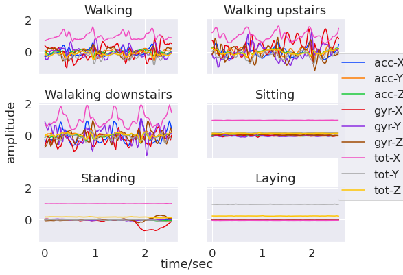
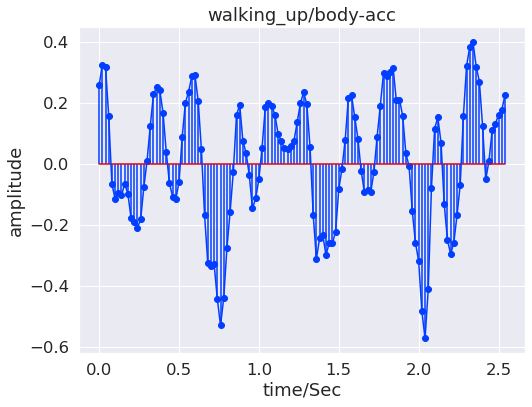
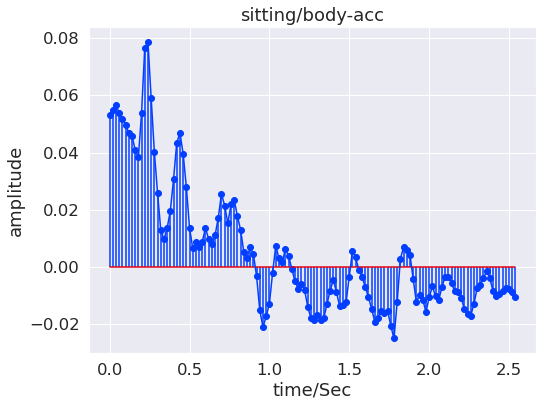
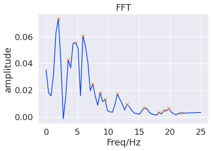
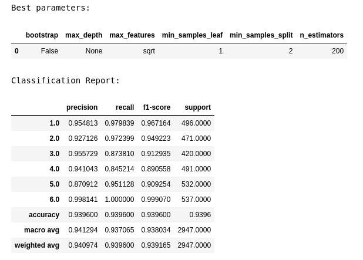
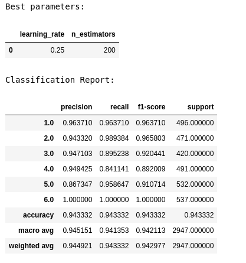
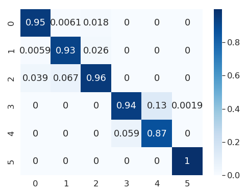
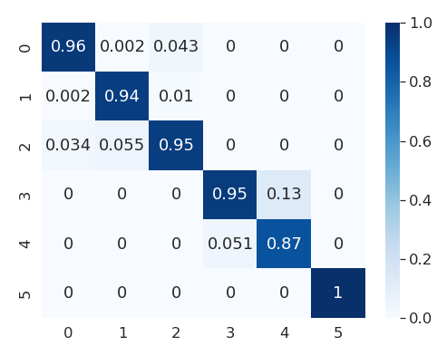
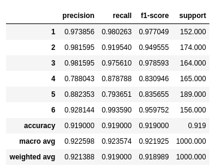
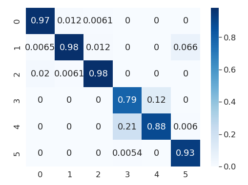

## Application of Machine Learning in Human Activity Recognition

### Author: Bis

### Introduction 

&emsp; Activity recognition has attracted considerable attention in the recent years with the advancement of sensor technologies. Smart sensors are enabled by internet of things (IoT) to send and receive data in unprecedented scale which unfolds a myriad of applications in our daily lives [1], manufacturing [2], healthcare [3-4]  smart homes [5] etc. Human activity recognition has been used to some very interesting applications, for example, in the order picking process [6], RFID based activity detection [4], smart reading activities using electrooculography (EOG) glasses [5], cryptocurrency mining [7], and many more. 
     
    
&emsp;	 The most convenient source of sensor data is perhaps our smartphones [3] which can do numerous measurements using either built-in sensors or with the help of software. Examples of some frequently used sensors in smartphones are video & audio recorders, vibrations and acceleration sensors using multi-axis accelerometer and gyroscope, magnetic compasses, and numerous other detectors including but not limited to touch and optical sensors.  Computer chips have become much smaller and so sophisticated that these are capable of capturing high-frequency physical inputs to local memories and operating systems [8]. Smartphone software can leverage these data to monitor, analyze and assist people’s daily lives, for example, it can tell if a person is running, walking, or standing.  It can deduce if a person is traveling by bus or in the car.  It can send an alarm message to a person if they have less attention span during driving. It can tell how many steps or what average heart rate one person has during her workout, and the list goes on.  Machine learning (ML) can provide insights from these types of unstructured signal data.  In the present study, various ML models were used to identify human activities based on a public human activity recognition dataset [9]. The concepts learned from Udacity’s Udacity’s "Microsoft Azure Scholarship Foundation Course” have been extensively used in this project.

### Dataset 

&emsp; UCI machine learning repository’s human activity recognition dataset [9] was used for this study. The dataset contains smartphone sensor acceleration signals which has gravitational and body motion components. The signals are sampled in fixed-width sliding windows of 2.56 seconds with 128 readings/window. The targets consist of six different activities – walking, walking-upstairs, walking-downstairs, sitting, standing and laying. The dataset is divided into train and test with a 70:30 ratio. The train and test signals consist of 7352 and 2947 samples, respectively.

### Exploratory Data Analysis

&emsp;	Each signal consists of 9 individual components – X, Y, Z axes of body, gyro and total accelerations as shown in Figure 1.  All walking signals (walking, walking-upstairs and walking-downstairs) correspond to larger amplitudes compared to resting signals (sitting, standing and laying). Therefore, walking signals have more wiggly features while sitting, standing and laying data are relatively flat. Identifying walking from the resting signals therefore should not be tough by visual inspection, but differentiating among various walking signals would be difficult. The same would be true for differentiating among various resting activities.

#### *Figure 1: Smartphone signals for 6 different activities. Each activity has 9 components.*

&emsp; Figure 2 displays stem plots comparing body accelerations signals of representative walking and sitting activities along Y-axis. The walking signal clearly shows some well-defined structure while the sitting one has very low intense peaks.
<table><tr>
<td>  </td>
<td>  </td>
</tr></table>

#### *Figure 2: Representative walking (left) and sitting signals (right). Amplitudes of walking signal are higher than that of the sitting.* 

### Feature Engineering & Data Preprocessing
	
&emsp; The time-domain signals were converted to frequency domain by Fast Fourier Transformation (FFT) [10], power spectral density (PSD) conversion [11], autocorrelation [12] and wavelet transformation [13]. The spectra obtained from the first three transformations were first smoothed by Savitzky-Golay filter followed by finding top 5 most intense peaks. Figures 3 shows FFT and PSD representations of a walking signal with the detected peaks.

<table><tr>
<td>  </td>
<td>  </td>
</tr></table>

#### *Figure 3: FFT and PSD transformations of a walking signal. The peaks detected n are also shown. Frequencies and intensities of top 5 most intense peaks were chosen for input feature matrix.*

&emsp; Both frequency and intensity values of top 5 peaks were taken into the input feature matrix. The feature matrix therefore has a total of 270 columns (9 components * (FFT + PSD + Autocorrelation=3) * 5 top peaks * 2 (Freq. + Intensity).  This matrix was used as input for three machine learning algorithms: Support Vector Machine (SVM), Random Forest (RFC) and Gradient boosting (GBC) classifiers. 

&emsp;Wavelet transformation was used to create a 127x127 input matrix with 9 channels corresponding to each signal component [14]. From the entire dataset 5000 train and 1000 test signals were randomly chosen to reduce the computational cost. The distributions of target classes were checked to see if both randomly selected train and test dataset are balanced.  These matrices were fed into a convolutional neural network (CNN) model for training and evaluation.

### Model Description
&emsp;Support vector classifier (SVC), random forest (RFC) and gradient boosting (GBC) classifiers were used from Scikit-learn’s machine learning library [15] for model training and evaluation. GridsearchCV was used to find the best parameters for each model. PyTorch was implemented for a convolutional neural network (CNN) training.  The model architecture consists of two convolutional layers with 32 and 64 input channels, 5x5 strides, RELU activation function, 2x2 maxpooling layers, followed by a fully connected hidden layer, and ending with a softmax output of 6 classes.  Crossentropyloss was used as a loss function. 

### Model Performance
&emsp;The classification reports and best parameters for RFC and GBC are shown in Figure 6. GBC performed slightly better than RF, with a macro averaged F1 score of 94.2% compared to 93.8%.

<table><tr>
<td>  </td>
<td>  </td>
</tr></table>

#### *Figure 4: Classification reports for RFC (left) and GBC (right). GBC has slightly higher macro averaged F1 score than that of RFC.*

&emsp; While both the models did better identify walking activities as well as laying, sitting and standing have relatively worse error rate, as shown in normalized confusion matrices for RFC & GBC in Figure 5. 
<table><tr>
<td>  </td>
<td>  </td>
</tr></table>

#### *Figure 5: Confusion matrices for RFC (left) and GBC (right).*

&emsp; CNN model was trained with a smaller train size (5000 samples), and it did performed slightly worse than RFC and GBC, F1 macro averaged score of CNN model is 92.5%. Figure 6 shows classification report and confusion matrix.
<table><tr>
<td>  </td>
<td>  </td>
</tr></table>

#### *Figure 6: Classification report and confusion matrix for the CNN model.*

### Conclusions
1. Features were extracted from a sensor dataset using FFT, power spectral density, autocorrelation and wavelet transformation.
2. ML and DL models were used to classify six human activities. RFC & GBC both provided good performances with macro averaged F1-scores of 94.2 and 93.8%, respectively.
3. To reduce computational cost a lower number of training & testing samples were used for CNN model training using a wavelet transformation feature extraction, which provided a macro averaged F1 score of 92.5%.

### Role of Udacity’s Microsoft Azure Scholarship Foundation Course
&emsp; Concepts learned from the foundation course were extensively used in this project. Feature selection and engineering were specifically used, along with “train a classifier” lesson in Lesson 3. The task used in this project was  supervised learning, which was discussed in Lesson 4. Concepts of feature learning was discussed in lesson 5, which I used to extract features from sensor data. The data is obtained from a public dataset and does not violate any privacy laws as far as my knowledge, and it was used responsibly, which is the theme of lesson 7. It would have been better if I could run the notebooks and deploy the ML models as a webservice using Azure. The idea was to run the notebooks locally for experimentation and then transfer the trained model to Azure for scale. Unfortunately, time did not permit but I’ll be working on it as the next steps of the project.

### Modules and notebooks
1. uci-har-eda.ipynb: contains basic EDA reported in this report.
2. model-results.ipynb: contains SVC, RFC and GBC model training and evaluation.
3. cnn-results.ipynb: contains CNN model training and evaluation.
4. utils.py contains utility functions, for example load_data, train_class, plot_stem etc.
5. feature_transform.py contains FeatureTransform class which was used to extract FFT and other features from the sensor dataset.
6. network.py contains CNN architecture implementation using PyTorch.

### References

(1) 	Chen, K.; Zhang, D.; Yao, L.; Guo, B.; Yu, Z.; Liu, Y. Deep Learning for Sensor-Based Human Activity Recognition: Overview, Challenges and Opportunities. ArXiv200107416 Cs 2020. 

(2) 	Moldovan, D.; Cioara, T.; Anghel, I.; Salomie, I. Machine Learning for Sensor-Based Manufacturing Processes. In 2017 13th IEEE International Conference on Intelligent Computer Communication and Processing (ICCP); 2017; pp 147–154. https://doi.org/10.1109/ICCP.2017.8116997.

(3) 	Majumder, S.; Deen, M. J. Smartphone Sensors for Health Monitoring and Diagnosis. Sensors 2019, 19 (9). https://doi.org/10.3390/s19092164.

(4) 	Li, X.; Zhang, Y.; Li, M.; Marsic, I.; Yang, J.; Burd, R. S. Deep Neural Network for RFID-Based Activity Recognition. Proc. Eighth Wirel. Stud. Stud. Stud. Workshop Workshop Wirel. Stud. Stud. Stud. 8th 2016 N. Y. N 2016, 2016, 24–26. https://doi.org/10.1145/2987354.2987355.

(5) 	Ishimaru, S.; Hoshika, K.; Kise, K.; Dengel, A.; Kunze, K. S. Towards Reading Trackers in the Wild: Detecting Reading Activities by EOG Glasses and Deep Neural Networks. In UbiComp/ISWC 2017 - Adjunct Proceedings of the 2017 ACM International Joint Conference on Pervasive and Ubiquitous Computing and Proceedings of the 2017 ACM International Symposium on Wearable Computers; Association for Computing Machinery, Inc, 2017; pp 704–711. https://doi.org/10.1145/3123024.3129271.

(6) 	Grzeszick, R.; Lenk, J. M.; Rueda, F. M.; Fink, G. A.; Feldhorst, S.; ten Hompel, M. Deep Neural Network Based Human Activity Recognition for the Order Picking Process. In Proceedings of the 4th international Workshop on Sensor-based Activity Recognition and Interaction; iWOAR ’17; Association for Computing Machinery: New York, NY, USA, 2017; pp 1–6. https://doi.org/10.1145/3134230.3134231.

(7) 	Abramson, D.; Fu, D.; Johnson, J. E. Cryptocurrency System Using Body Activity Data, March 26, 2020.

(8) 	The Complete Guide to Machine Learning for Sensors and Signal Data. Reality AI.

(9) 	UCI Machine Learning Repository: Human Activity Recognition from Continuous Ambient Sensor Data Data Set https://archive.ics.uci.edu/ml/datasets/Human+Activity+Recognition+from+Continuous+Ambient+Sensor+Data (accessed Sep 16, 2020).

(10) 	scipy.fft.fft — SciPy v1.5.2 Reference Guide https://docs.scipy.org/doc/scipy/reference/generated/scipy.fft.fft.html (accessed Sep 17, 2020).

(11) 	scipy.signal.welch — SciPy v1.5.2 Reference Guide https://docs.scipy.org/doc/scipy/reference/generated/scipy.signal.welch.html (accessed Sep 17, 2020).

(12) 	numpy.correlate — NumPy v1.19 Manual https://numpy.org/doc/stable/reference/generated/numpy.correlate.html (accessed Sep 17, 2020).

(13) 	Continuous Wavelet Transform (CWT) — PyWavelets Documentation https://pywavelets.readthedocs.io/en/latest/ref/cwt.html (accessed Sep 17, 2020).

(14) 	Ahmet Taspinar. A guide for using the Wavelet Transform in Machine Learning. Ahmet Taspinar, 2018.

(15) 	scikit-learn: machine learning in Python — scikit-learn 0.23.2 documentation https://scikit-learn.org/stable/ (accessed Sep 17, 2020).

