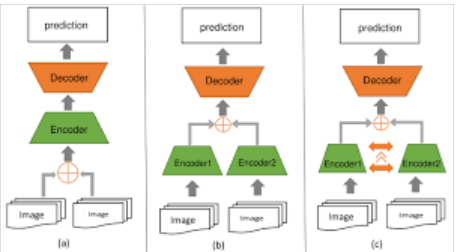
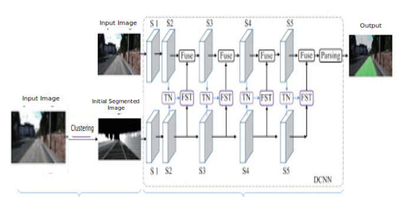
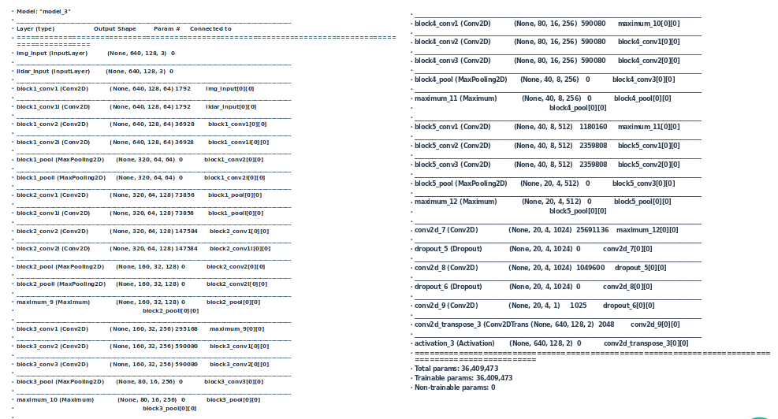
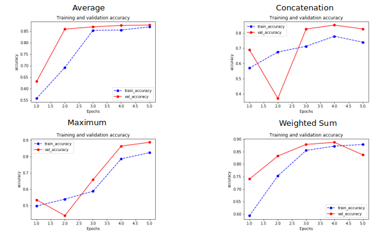
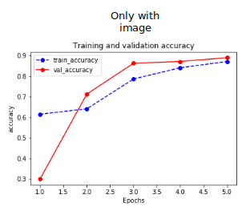
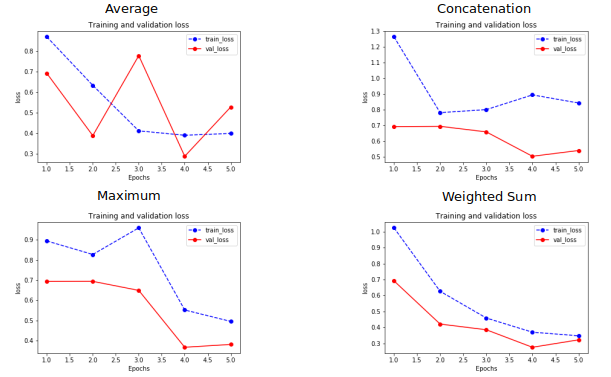
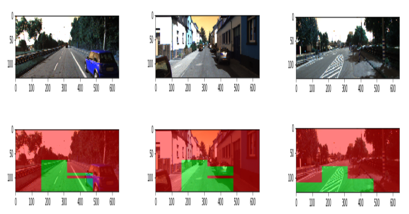
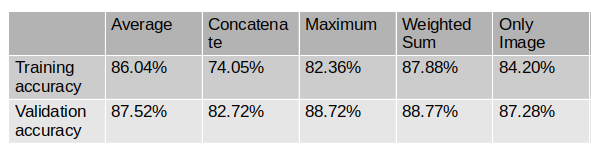

# Road segmentation using feature fusion
​
## Project implemented by : 
Dhvani Katkoria
​
## Introduction
​
  
     
Road detection is beneficial for various autonomous vehicles tasks. Robust road segmentation is a key challenge in self-driving research. Despite rapid developments in visual image-based road detection, robustly identifying road areas in visual images remains challenging due to issues like illumination changes and blurry images. To improve better road detection and segmentation the same image is used in different way for features extraction and this features are combined with the features extracted from original image. Image is initially segmented using K-means clustering into 3 parts end, LiDAR sensor data can be incorporated to improve the visual image-based road detection, because LiDAR data is less susceptible to visual noises. The project is to perform segmentation of road regions from given input image using fusion of features. Two set of images are used for training a CNN model: Original image and basic segmented image using K-means clustering. Features of both images are fused to obtain better accuracy in segmentation task. 
​
​
## Dataset: 
**Kitti Road/Lane Detection Evaluation 2013:** Dataset is used for road segmentation. The dataset consists of 289 training and 290 test images. Link : http://www.cvlibs.net/datasets/kitti/eval_road.php It contains three different categories of road scenes:
​
- uu : urban unmarked (98/100)
- um : urban marked (95/96)
- umm : urban multiple marked lanes (96/94)
​
​
  
  
Image above shows sample image and its ground truth. However, the ground truths are available only for training images. Hence, only training images are used for project and the same is divided into training and test data for model training and evaluation.  
​
​
## Knowledge from coursework:
​
- Image encoding is used to convert image data into 3D array with (R,G,B) values at each pixel position.
- K-means clustering is applied to image for initial segmentation of image into 3 parts assuming image is segmented for each part represented by road, sky, other objects. So, for each part features can be extracted and used along with original image features for model training.
- Feature learning is important to imagederive new features in dataset. We learn features from original image as well as from initial segmented image using CNN model and merge the features obtained from both the images for better feature learning and precise segmentation.
- The project is implemented using publicly available dataset to avoid any kind of harm to anyone's privacy. 
- Model evaluation metrics like accuracy, precision, recall, Mean IOU and AUC scores are used for evaluation of trained model.
- Visualizing results is important for anyone to observe the precision of results obtained. Training and validation accuracy scores are plotted for each epoch to observe the learning graph. Output segmented image is visualized with original image for clear view of segmented area.
​
## Innovation, Implementation and Evaluation:
​
- CNN model with layers of VGG-16 model is used here for feature extraction. Fusion of features obtained from the same image utilized in different way after each block is a novel approach used here. Also, extracting features from initially segmented image helps boost the learning of features.
- Features are extracted from original input image and basic segmented image obtained using K-means clustering. Features are extracted after each of 2nd, 3rd, 4th and 5th block and are fused using given fusion technique. 
- Fused feature output are fed to next block for original input image feature extraction. Intention is to obtain precise segmentation for original input image, hence fused features are not passed to blocks to basic segmented image. 
- The three typical fusion structures can be used as shown in the below image. Figure(a) depicts early fusion mode, in which features are fused at the input layer. Figure(b) is late fusion in which two side-by-side encoder will merge at the end of encoding stage(before decoding). Figure(c) is stage-wise fusion, meaning that fusion happens at every stage inside the encoder. Here, stage-wise fusion is performed after extracting features at each stage.
​
      
​
- Different fusion techniques can be applied for merging intermediate output layers. Here, following fusion methods are used for merging intermediate outputs: 
**weighted_sum :** uses weighted sum of features with 0.3 weight to clustered image feature and 1 to original image
**maximum :** Computes the maximum (element-wise) a list of inputs.
**Average :** averages a list of inputs element-wise.
**concatenate :** concatenates a list of inputs.
**no_fusion :** train model only using original input without any fusion
- Architechture of model used is as shown below.

​
-Model summary for **maximum** fusion type is as shown below.
​
    
​
- Evaluation of model is done using Accuracy, Precision, Recall, AUC and Mean IOU metrics.
- Training and validation accuracy and loss plots for each fusion type to visualize the accuracy and loss are as shown below:
       
     
- Output images are visualized against the original image using transparency. Output image are pixels are assigned green and red RGB values based on the probabilities of 2 classes (Road & Non Road) predicted by model. Output image and input image are fused using average of each pixels of each image for transparency. Few results are as shown below. 
      
      
-Notebook contains the code implemented in google colab.
​
## Impact and Future scope
- As stated in introduction section road segmentation is beneficial for various autonomous vehicles tasks.
- Improving robustly identifying road areas in visual images can be very useful for self driving vehicles.
- In this project owing to limitation of GPU memory, image size were reduced to (640,128) which resulted in loss of accuracy and precision. Also, model could be trained for very less number of epochs due to exhaustion of resources. This limitations can be overcomed and better result can be obtained with higher memory processor in future.
- Similar to VGG-16 model layers used here, other existing models or custom models can also be used for better results.
- This same model can be made to generate resuts in real time and be embedded or hosted on any app or web services for general purpose.
