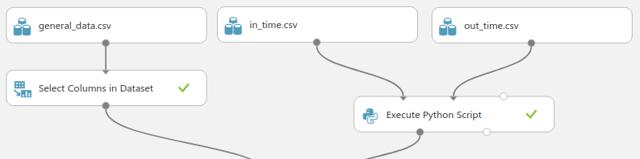
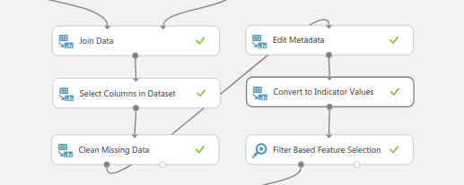
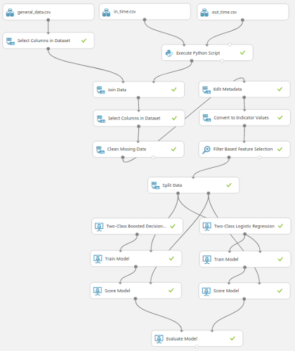
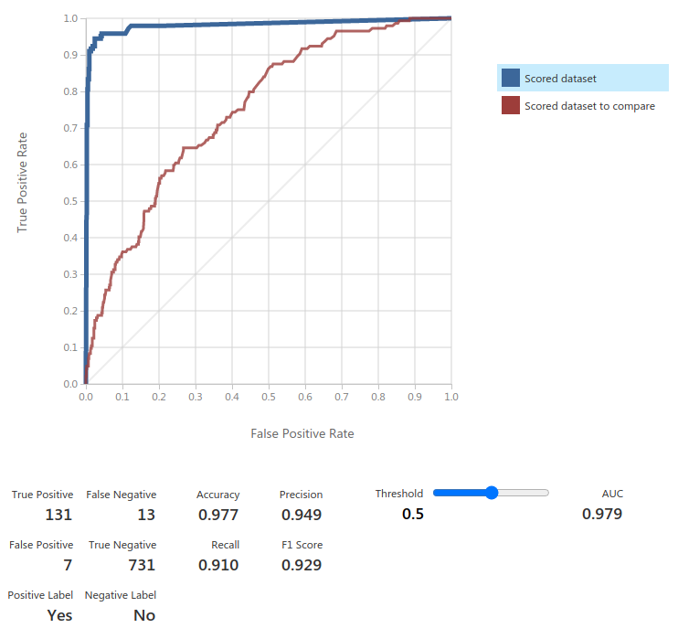

# Reduce Employee Attrition

## Authors

- @Mariia - sg_paic - https://github.com/MariiaDen
- @EnricoD - sg_paic - https://github.com/edab

## Implementation

The implementation is based on the Microsoft Azure ML technology, using the Azure Studio Classic tool accessible from this [link](https://studio.azureml.net/).

### Dataset

The dataset used for this project is the HR Analytics Case Study by Vijay Choudhary available through Kaggle [Link](https://www.kaggle.com/vjchoudhary7/hr-analytics-case-study).

The Dataset contains information about 4410 Employee, organized as follows:

- ***Employee Time Tracking***
  - Check-in time of all 2015
  - Check-out time of all 2015
- ***Employee basic information***
  - _Age_: Age of the employee
  - _Attrition_: Whether the employee left in the previous year or not
  - _Department_: Department in company
  - _DistanceFromHome_: Distance from home in kms
  - _Education_: Education Level
  - _EducationField_: Field of education
  - _EmployeeCount_: Employee count
  - _EmployeeNumber_: Employee number/id
  - _Gender_: Gender of employee
  - _MonthlyIncome_: Monthly income in rupees per month
  - _MaritalStatus_: Marital status of the employee
  - _NumCompaniesWorked_: Number of companies the employee has worked for
  - _JobLevel_: Job level at company on a scale of 1 to 5
  - _JobRole_: Name of job role in company
  - _Over18_: Whether the employee is above 18 years of age or not
  - _StandardHours_: Standard hours of work for the employee
  - _StockOptionLevel_: Stock option level of the employee
  - _TotalWorkingYears_: Total number of years the employee has worked so far
  - _WorkLifeBalance_: Work life balance level
  - _YearsAtCompany_: Total number of years spent at the company by the employee
  - _YearsSinceLastPromotion_: Number of years since last promotion
  - _YearsWithCurrManager_: Number of years under current manager
- ***Employee last year metrics***
  - _BusinessTravel_: How frequently the employees travelled in the last year
  - _PercentSalaryHike_: Percent salary hike for last year
  - _TrainingTimesLastYear_: Number of times training was conducted for this employee last year
- ***Employee survey data***
  - _EnvironmentSatisfaction_: Work Environment Satisfaction Level
  - _JobSatisfaction_: Job Satisfaction Level
  - _RelationshipSatisfaction_: Relationship satisfaction level
- ***Employee manager data***
  - _JobInvolvement_: Job Involvement Level
  - _erformanceRating_: Performance rating for last year

The Check-in and Check-out time of all employee is converted, using a python script inserted into the pipeline using the ***"Execute Python Script"*** block, into more useful features,

### Data Cleaning and Preparation

The dataset has some missing data, which has to be handled, some features should be converted using one-hot encoding, and the check-in and check-out employee information should be converted into some useful new features.

#### Conversion of check-in and check-out data

For processing this data a custom python script based on Pandas library was created and inserted into the pipeline.

In time tracking of each employee daily, we found out that some columns are completely empty, while some are missing data. The missing data turns out to have a meaning, and can be interpreted as an absence. Therefore, columns that have more than 90% of missing data are removed completely (since those are holidays and don’t play any role), and the nulls in the other columns are considered as an absence of the employee on that specific day.

In order to make the data useful for our model a feature engineering is done to create two useful new features, which are the ***average time spent*** at work and the ***number of days of absence***.

#### One-hot encoding

The following features need to be converted using one-hot encoding, before feeding them into the model:

- BusinessTravel
- Department
- EducationField
- Gender
- JobRole
- MaritalStatus

This was done using the “Edit Metadata” and “Convert to Indicator Values” Azure ML blocks.

#### Feature selection

For performing a feature analysis an “Filter Based Feature Selection” tool was used, limiting the total amount of features to use to 24. The result of the correlation analysis lead to the use of the following features:

- MaritalStatus-Single
- Age
- YearsWithCurrManager
- YearsAtCompany
- BusinessTravel-Travel_Frequently
- EducationField-Human Resources
- MaritalStatus-Married
- MaritalStatus-Divorced
- Department-Human Resources
- BusinessTravel-Non-Travel
- JobRole-Research Director
- BusinessTravel-Travel_Rarely
- TrainingTimesLastYear
- JobRole-Manufacturing Director
- average (average time worked)
- Missing (number of days being absent)
- total (total number of hours worked)
- EducationField-Technical Degree
- YearsSinceLastPromotion
- PercentSalaryHike
- MonthlyIncome
- JobRole-Research Scientist
- EducationField-Other
- Department-Sales

The measures are sorted by correlation - descending. Which means MaritalStatus-Single has the highest - 0.175419, and Department-Sales the lowest - 0.019742.

#### Data Analysis

Since the dataset is labeled, an experiment was created to compare the performance of two binary classifiers - Two-Class Boosted Decision Tree, and Two-Class Logistic Regression to predict if an employee will leave the company.

According to the Microsoft documentation [Link](https://docs.microsoft.com/en-us/azure/machine-learning/studio-module-reference/two-class-boosted-decision-tree#module-overview):
***Boosted decision tree*** is an ensemble learning method in which the second tree corrects for the errors of the first tree, the third tree corrects for the errors of the first and second trees, and so forth. Predictions are based on the entire ensemble of trees together that makes the prediction.

Boosted decision trees are considered to be the simple ones, with the highest accuracy. Though they are very memory-consuming, the provided dataset sizes allow us to use it effectively.

***Logistic regression*** is a well-known method in statistics that is used to predict the probability of an outcome, and is especially popular for classification tasks. The algorithm predicts the probability of occurrence of an event by fitting data to a logistic function. [Link](https://docs.microsoft.com/en-us/azure/machine-learning/studio-module-reference/two-class-logistic-regression#bkmk_Notes)

Logistic regression is a linear model with fast training times.

### Architecture

The complete architecture designed using the Microsoft Azure ML studio (classic) is depicted below.

The top part of the graph is used by the data preparation and filtering. The Split Data block is configured to use 80% of the data to train the models, and the remaining to test it.

The results of the Score Models are fed to the Evaluate Model as inputs, which allows to compare results from two different models on the same data. This is also possible, since both  algorithms are the same algorithm type.

### Results

The results of the experiment have shown a very high accuracy - 97.8%. Which means that we are able to predict with a good precision whether an employee might be thinking of leaving a company.

