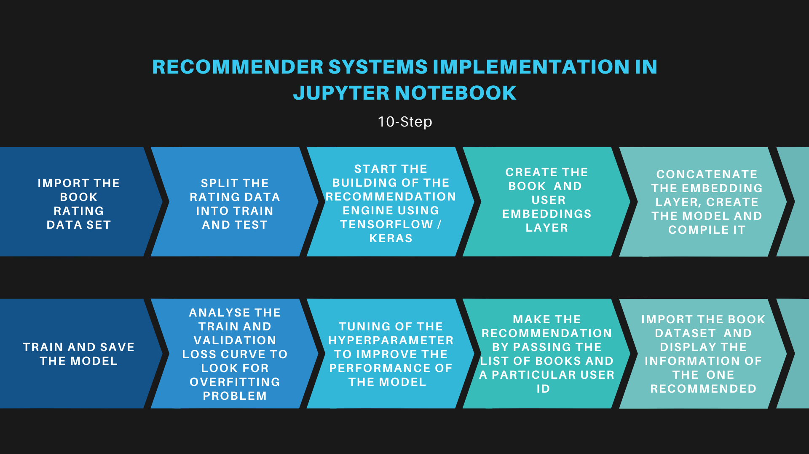
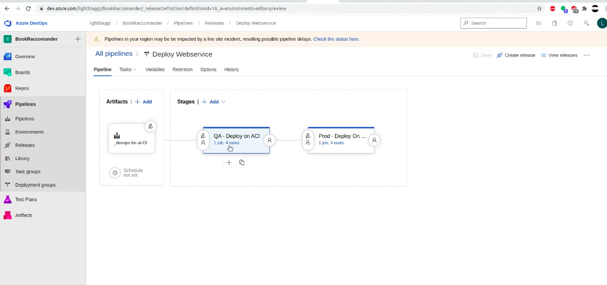
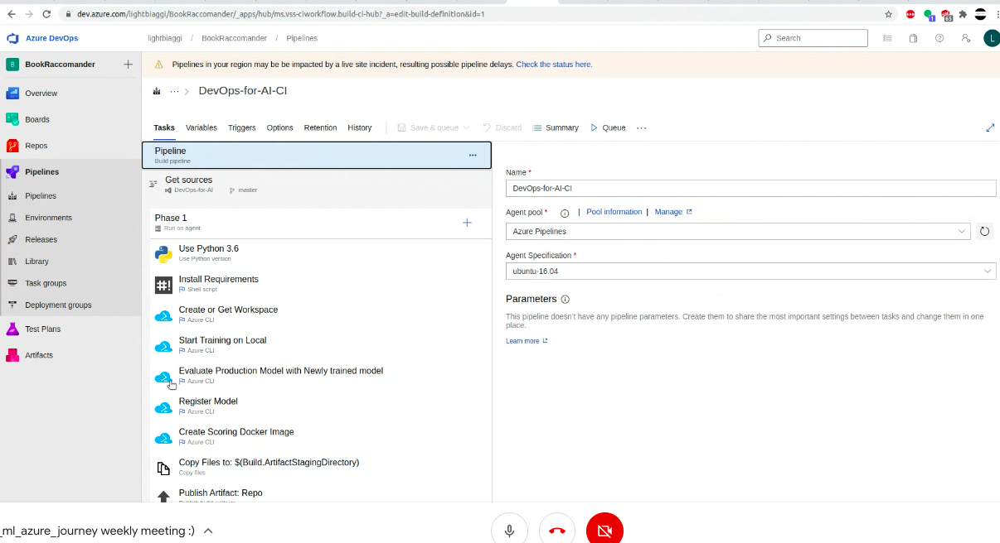
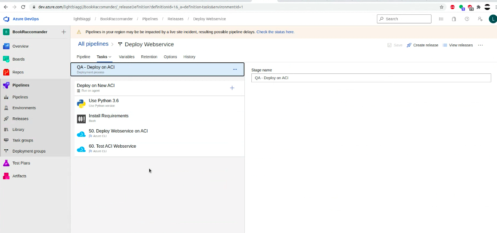

### Author: Leo Biaggi , Hanane Ouhammouch

# Book recommendation with AzureDevOps CICD integration

The Object of this Project is to build and deploy a recommendation System to predict the rating a user will give to a book based on his old preferences. 

## Prerequisite
- Anaconda - Jupyter Notebook for the creation of the Model
- Azure DevOps for the deployment of the Model

## From the creation to the deployment  :

You can find bellow more details :

### Model Implementation using Jupyter Notebook :

#### Introduction of recommendation system :

A recommendation system seeks to model a user Behavior regarding a Product , which help to understand how user interact with items.

There are 3 type of recommendation system :

1. Collaborative Filtering System:This system builds a model of the user based on past choices, activities, and preferences. 

2. Content-Based Filtering System:This system builds an understanding of similarity between items. It recommends items that are similar to each other in terms of properties.

3. Hybrid Approach : This approach combines the collaborative and content-based approaches to build  more generalized systems. 

#### Approach used in this Project:

This Project used a technique called embedding *(special kind of neural network layer)* to build an understanding of the interaction between users and book **which is an hybrid approach**

#### Library used in this Project:

This model used  **Keras** And **TensorFlow** for the implementation 

1.Keras: an open-source neural-network library written in Python. It is capable of running on top of TensorFlow https://keras.io/

2.Tensorflow :is a Python library for fast numerical computing created and released by Google.It is a foundation library that can be used to create Deep Learning models directly or by using wrapper libraries that simplify the process built on top of TensorFlow *(Keras)*

#### Procces of the model Implementation in Jupyter Notebook:

More information are included in the notebook **https://github.com/lightbiaggi/BookRaccomandationAzureDevOps/blob/master/model/BOOKS.ipynb**

#### Procces of the model integration and deployment with Azure DevOps:

To create this process we have followed the following steps

**1. CI or continuous integration phase :**

**1. CD or continuous development phase :**

# Next step create the end-point and build a Book recommender website to use this model 

