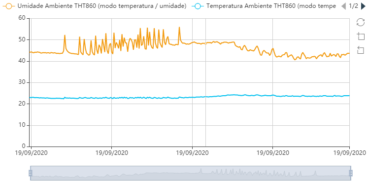
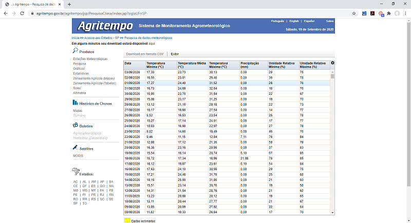
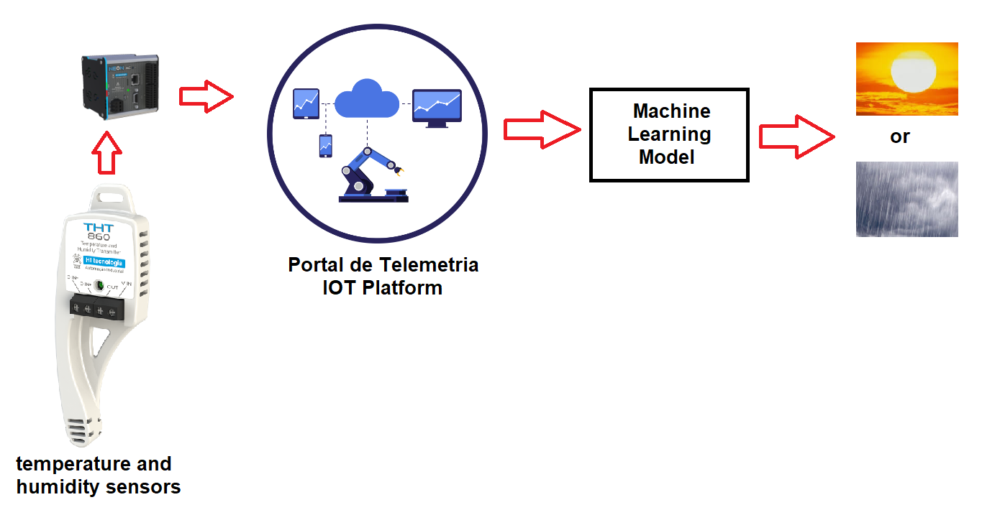

# Beat the "heads or tails" strategy in the weather forecast

**Project name**: Beat the "heads or tails".

**Team name**: DataWeather4Cast.

**Used Technology**: RandomForest, Python, REST API, Matplotlib, Seaborn, Pandas, Numpy and others libraries.

**Who the project is for**: This project demonstrates that sometimes information from sensors and systems can help to solve problems outside or far from them. It also shows the complete process from collecting data to predicting results. I hope anyone seeking for this type of knowledge can learn something with it.

The goal from this project is to evaluate how temperature and humidity sensors from a data center is good for predicting rain precipitation.

When I was a kid there was no google or other modern tools to search for or get information about the weather forecast.

I remember that at some point (sorry, it's been over 30 years) some TV shows started to release the weather forecast.

At the time, it was an incredible thing (at least for me) and it felt like magic.

The accuracy of this prediction, however, was not that "magical". I remember some people joking about it. Do you want to know if it will rain tomorrow? Ask to the "heads or tails" is more accurate than the TV weather forecast. The interesting thing is that although this is not true today, at the time it really happened.

The purpose of this project is to try to beat the "heads or tails" in the weather forecast, that is, obtain accuracy better than 50% to answer the following question: is it going to rain or not tomorrow?

The data were collected from two sources:

 1. Temperature and humidity of the datacenter: a service called ["Portal de Telemetria"](http://app.telemetria.hitecnologia.com.br) from the company [HI Tecnologia](http://www.hitecnologia.com.br/). At this service, data from industrial controllers are recorded, visualized and can be collected through an rest api. The data center belongs to HI Tecnologia itself and the data I used can be seen from the tool using a demo option (which uses data from real sensors). The following image is a chart generated by the tool;

 2. Daily precipitation: Daily precipitation data was obtained from [Agritempo] (https://www.agritempo.gov.br/) (Agrometeorological Monitoring System), a system that allows users to access, through the Internet, meteorological information and agrometeorological activities in several Brazilian municipalities and states.

The following image shows the final solution architecture, which is divided in (1) collecting daily data from sensors and (2) applying algorithm and check what does he tells about raining in the following day:

 

The [jupyter notebook](./weather-forecast-using-iot-data.ipynb) cells are divided in:

 1. Collecting the data;
 2. Preparing the data;
 3. Feature Engineering and analysis;
 4. Model training;
 5. Results.

At the end of the notebook you can see what was the accuracy from the model on answering the following question: is it going to rain or not tomorrow?
 
