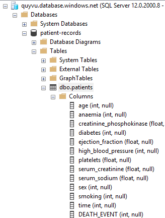
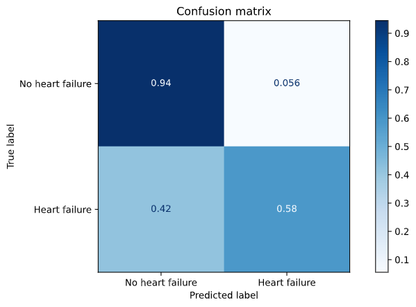
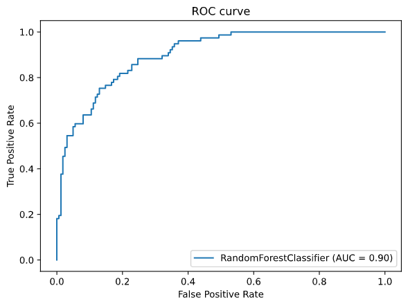
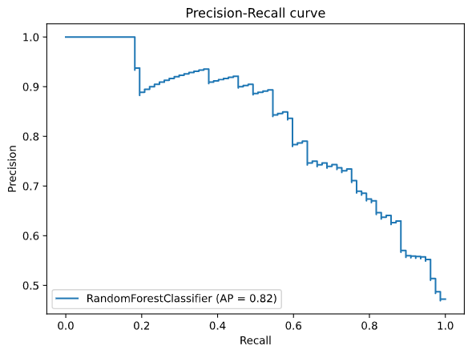
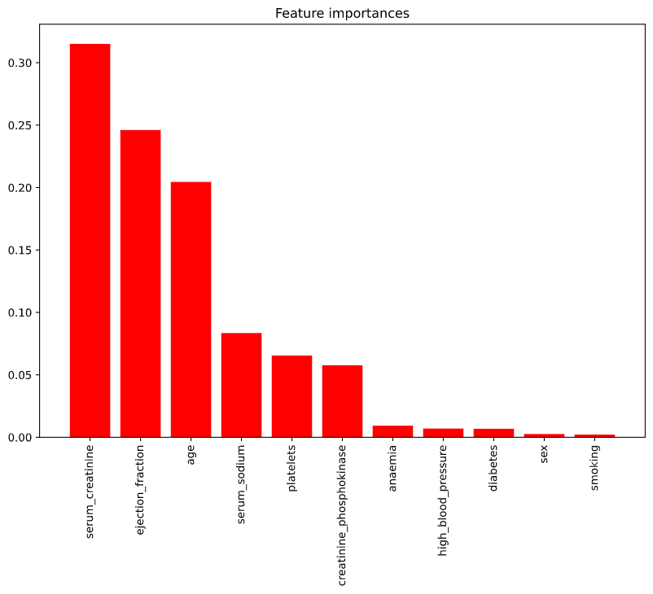
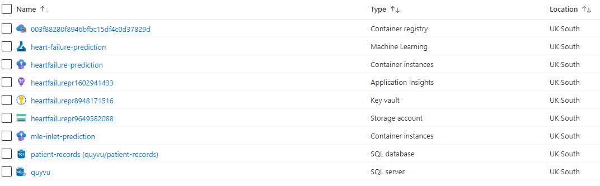
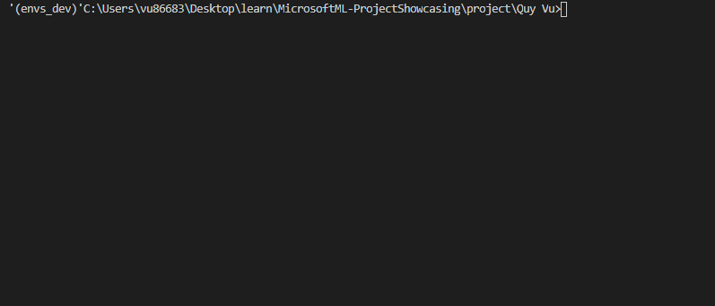
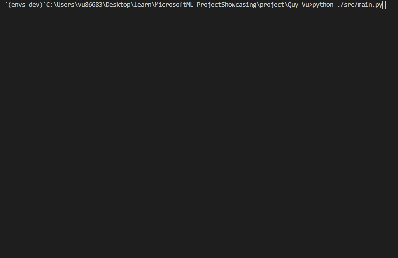

# Predicting heart failure with machine learning

This project utilises Python and Azure suite of products to provide prediction for heart failure.

## 1. Overview

### 1.1. Team member

Name: Quy Vu </br>
Email: xquy.vu@gmail.com

### 1.2. Project motivation

Cardiovascular diseases kill approximately 17 million people every year, and they mainly exhibit as myocardial infarctions and heart failures. Heart failure occurs when the heart cannot pump enough blood to meet the needs of the body.

Given the availability of electronic medical records, it is potential to perform analysis to highlight patterns and apply machine learning methods to predict heart failure. By having access to a reliable and accurate prediction systems doctors and the personnel in charge can be assisted in diagnosis and providing recommendations to patients to decrease the risk of heart failure.

Given the importance of the issue, in this project, I've developed a machine learning model to predict the probability of heart failure for from patient medical data using a dataset of 300 patients. In addition, to create a footprint for how potentialy this product works in practice and ensure its reproducibility, it was mainly implemented in Python (`numpy, pandas, scikit-learn, pyodbc`) and deployed using Azure suite of products (SQL Database, Azure Machine Learning).

### 1.3. Responsible AI

- Privacy and security: Since medical data is highly sensitive and thus need to be properly secured, the data is stored in an Azure SQL database with security roles applied, giving access to only those who are responsible of managing patient data. In addition, the database only holds non-identifiable information such as age, smoking, diabetes, etc. which ensure anonimity of patients.
- Transparency and reliability: The importance of features can be obtained from the Random Forests algorithm, allowing cross-checking with current literature to ensure the pattern is reliable.
- Reliability and safety: The pipeline was fully tested during development and after deployment to ensure robustness

### 1.4. Methods

#### 1.4.1. Database

The patient data is stored in an Azure SQL database, which makes dataset management easier and scalable. The data can be queried by using either Microsoft SQL Management Server application or Python library `pyodbc`. In this project, the latter approach is utilised so the data can be then preprocessed using `numpy` and `pandas` libraries.

The database schema is as follows:



#### 1.4.2. Model training

The processed data were then served as training data for a Random Forest model (`scikit-learn`). The model hyperparameters were then optimised using a grid-search method. As always, there will be a trade-off between false-positives and false-negatives. In heart failure detection, it is vital to detect potential failures and false-negatives are less costly. Therefore, the most important metrics to be optimised was selected to be Recall. As a result, the model that gives the best recall on the test set is selected to be the most performing model.

#### 1.4.3. Model deployment and serving

After the most performing model is decided, it was then deployed on Azure machine learning as a webservice using the Azure ML Python SDK `azure-ml`. Deploying the model as a webservice allows scalable predictions to thousands of patients at the same time and makes the product integrable into other systems.

### 1.5. Results

The table below shows the results of the most performing Random Forest model. Point metrics were calculated assuming patients with a probability of heart failure >= 0.5 were considered to have a heart failure. The results translate into:

- Out of 100 predictions, 83 of them are correct.
- Out of 100 patients with potential heart failure, 58 of them were detected by the ML model.
- Out of 100 patients predicted as risk having a heart failure, 83 of them actually do/did/will.

| Metric              | Score |
| ------------------- | ----- |
| ROC AUC             | 0.90  |
| AUPRC               | 0.62  |
| Accuracy            | 0.83  |
| Precision           | 0.83  |
| Recall              | 0.58  |
| F1-score            | 0.69  |
| True Positive Rate: | 0.58  |
| True Negative Rate: | 0.94  |
| Log loss            | 0.43  |






### 1.6. Azure resources

The following Azure resources were utilised by this project



## 2. Demo

Prediction for 1 patient



Prediction for multiple patients



## 3. How to use

### 3.1. From the command line

Run the following bash command and input patient(s) data such as diabetes, smoking, age, etc.

```bash
python ./src/main.py
```

### 3.1. Using a Python script

You can get the probability that someone will have a heart failure by sending a POST request with the patient's details to the Azure ML endpoint.
Example is as follows. Note that the endpoint may become unavailable should I decide to shut it down.

```python
patient_data = {
    "age": [47, 55],
    "anaemia": [0, 1],
    "creatinine_phosphokinase": [582.0, 512.0],
    "diabetes": [0, 1],
    "ejection_fraction": [25.0, 50.0],
    "high_blood_pressure": [0, 1],
    "platelets": [130000.0, 125000.0],
    "serum_creatinine": [0.8, 0.87],
    "serum_sodium": [134.0, 102.0],
    "sex": [1, 0],
    "smoking": [0, 1]
}
response = requests.post(
    'http://1340b721-d646-4f9b-b888-7884277f9dc3.uksouth.azurecontainer.io/score',
    json.dumps(patient_data),
    headers={'Content-Type': 'application/json'}
)
prediction = json.loads(response.content)
print(prediction)
```

## 4. Installation for development

- Download anaconda from [here](https://www.anaconda.com/products/individual)
- Open Anaconda Prompt (from start menu)
- cd to the location of this project

```bash
conda env create -f conda_env_test.yaml --prefix ./envs_dev
```

If you want to update dev environment: Run the `./src/initialise.py` first then the following bash command

```bash
conda env update --prefix ./envs_dev --file conda_env_test.yaml
```

## 5. Project implementation

```
|   config.json         <- Azure workspace config
|   metadata.json       <- Deployment metadata
|   requirements.txt
|   conda_env.yaml      <- conda env for deployment
|   conda_env_test.yaml <- conda env for development
├── data                <- Data for EDA and model evaluation
|
├── database_setup      <- Setting up the SQL database
|   ├── create_schema.sql   <- Create the table schema
│   └── initial_import.sql  <- Dataset import
│
├── demo                <- Recording of application demo
|
├── src
|   ├── deploy.py       <- Deploy the ML model as an Azure web service
|   ├── evaluate.ipynb  <- Model evaluation
│   ├── get_data.py     <- Get data for model evaluation
|   └── initialise.py   <- Initialise workspace and environment for development and deployment
|   ├── main.py         <- Application for user
|   ├── score.py        <- Model entry script
|   ├── train.py        <- Query the data from the SQL database, then train and register the ML model on Azure ML
|   └── utils.py        <- Utility functions
│
├── models              <- Hold the best obtained model
|
├── outputs             <- Model evaluation output
|   ├── test
|   └── train
|
└── tests_              <- For testing
```

## 6. Future work

Since the main aim of this project is to focus on developing and deploying a machine learning product, I have skipped out a large part of the data science process (exploratory data analysis, hyperparameter tuning, feature selection, etc.). This was also due to limited amount of time and resources as I'm working full time and also work on this project solo. I believe a lot could have been done to improve the machine learning part. The 3 most important components are as follows:

- More sophisticated hyperparameter tuning (Bayesian search, AutoML)
- Feature selection based on feature importance
- Apply interpretation methods (e.g. SHAP) to understand the patient's condition and suggest potential treatment
