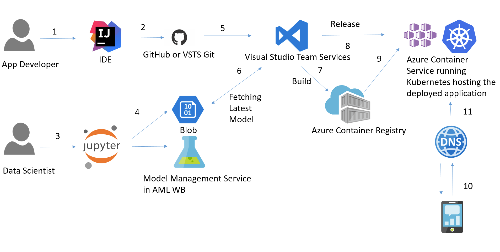
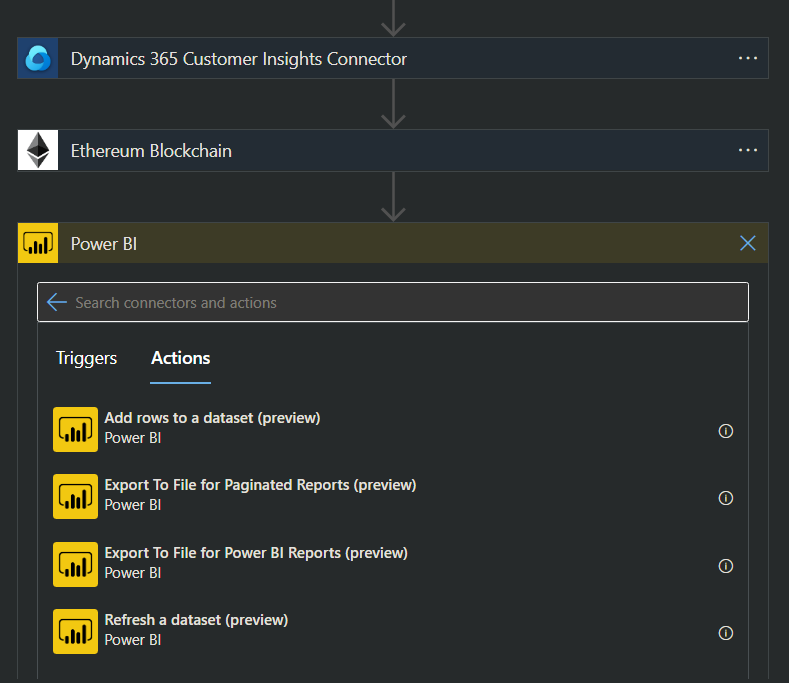

# Decision Intel Foresights MLSecOps Automation MICROSERVICE
...

## Description
TL;DR: The partial federated MLSecOps MICROSERVICE of a trustless microservices baselining ecosystem that is currently featuring Predictive Analytics Foresights, Cybernetics Precognition and Pseudonymised Data-Governance for an end-to-end Decision-Intelligence platform/solution; prioritising data interpretation [seeing the bigger picture, not merely data fitting regularisation] and strategically planning the pipeline of projects driving forward 1st quantitative ability; with a vision of skunkworks type C/DAOs that build innovative software to allow senior stakeholders to make effective data driven decisions and help transform governance with suggested decision boundary, probabilistic statements and assumptions about uncertainty.

# Microsoft Azure Scholarship Project Showcasing Challenge
[Link to guidelines](https://docs.google.com/document/d/1p0rplg0ZrIFfBabY1WyhyVOxjVjxMORC3koV00rscAI/edit)
Alas, not all criteria were fully met!

### Using Azure for Implementation based on Course Material
In light of this Project Showcase Challenge prerequisites / preferences [on adopting the Microsoft Azure ecosystem exclusively] opted to use the Microsoft Cloud App Security CASB (Cloud Access Security Broker)**** to check whether the Foresights MLSecOps DApp can be certified as compliant with SOC2 and/or GDPR via Microservices/DLT Black-Box Pen-Testing; while deploying the Microsoft RPA [Power Automate, pka: Flow] integration with its Application Inspector [for [Zero-Trust Federated DLT dApp] MLSecOps] in the next microservice’s pending phase that was recently postponed [given the time scope, the real challenge of pulling off an R&D that not only pass the chasm of peaked hype, but rather make it to plateau of productivity in time and within budget of limited man-hours resources]; once had to confirm the low p-value improbability of the "move fast and break [monotony] things" null hypothesis's default alternative via regression to the [decision theory] Bayesian paradigm of [platonicity ludic fallacy] subjective deduction; and rather [then kept calm! and] carried on slowly [but surely] predictive inferencing with the [strategic, long-term] frequentist multi-objective induction paradigm for the Trickle-down [Just Equity] Foresights of [Difference Principle] Maximin; let alone using [the statisticians' favourite: Microsoft's] R for [binomial] logistic regression model [imputed variables' response probability w/o ROC] foresights evaluation
Moreover, the project is hosted in Azure, using Sentinel, Azure App Logic, App Service, connected for CI/CD DeveOps to [the teams github repository](https://github.com/Foresights-IT/MicrosoftML).

### Current MICROSERVICE Implementation
Frequentist Statistician-centric Envisioned MLSecOps Foresights METHADOLOGY:
Dataset [OData feed] table dynamically scraped from RealClearPolitics.com and/or Electoral-Vote.com for the last available elections data [using scraping scripts], table data read, columns renamed, null values dropped or imputed, index reset, data averaged, numbers cleaned up, time-series soft checked, [non]straddle years ordered, dates median indexed, unique polls sorted, weights rated, names map cleaned up, weights inner-merged, exponential decay adjusted, binomial MoE sampled, TE determined, induced error calculated [sample/cumulative/ESS/MESS], time-weight based aggregated, parsed old dates cleaned, entire population means aggregated, recency restricted, trend line adjusted, nearest-neighbour clustered, PVI(Partisan Voting Index) set, electorate party affiliation set, census demographics factored in, economics variables [job-growth / personal-income / industrial-production / consumption / prices-inflation] indicated, economic index median-forecasted, given contribution sums kmeans-clustered, closest [L2-norm] clusters indexed, kmeans groups sorted, kmeans tick-labels reset, poll/spread ticker scatter-plotted, nonparametric [lowess] stats-modelled, time-trends adjusted, merged data baselined, regression fitted, residual unique groupings plotted, model [exog] predicted, time uncertainty corrected, correction trends merged, trends product set, trend estimates and national polls concatenated, weights PIE mean summed up, weighted mean aggregated, prediction results exported, electoral votes sort-merged and tallied!

### Impact
Foresights MLSecOps for AMR (Autonomous Mastery Realisation) of [Local Governance Crowd-sourcing Constituents] Decision Intelligence (with civil liberties protection and full access and cybernetics privacy control of all PIIs [Personally Identifiable Info]); Creatively Supporting C/DAOs Consortia Constituents (via UBI insuring Cooperative Collectives with smart contracts); Sustainably Securing Social Public [Medical / Environmental / Educational / Economical / Cultural / Governmental] Engagement Innovations via an Optimised MLSecOps' Platform/Solution [adapting latest emerging trends in Cyber Ethics [pivotal best practice] on the application of vital ethics for all involved IT developers or DPOs while securing interactions in the various related digital landscapes]; in addition to its exemplary design principles [based on: Networked Integrity, Distributed Power, Value as Incentive, Security, Privacy, Preservation of Property Rights, and Inclusion]; with it's key innovative ingredient being its holistic multi-layered approach for such [interdisciplinary, all-inclusive, coordinated consensual] broad integration scope, and its promising ‘incentivized’ UBI-insured social ROI for such ambitious ‘decentralised’, trustless, incorruptible, open-source, interoperable, persistent, unobtrusive, passive, secure, privacy-first, constituent-centric, smart ecosystem for the ‘incentivized’ storage, sharing and utilisation of personal records using DTL (Decentralised Ledger Technology) to empower constituents to be the centre of their own personal record management; while maximising stakeholder value (equity, access, inclusion, and socioeconomic factors) and preserving privacy and confidentiality, to drive benefits from data through broader use, collaboration and monetisation without compromising on fostering public trust (of free societies’ civil liberties protections).

### Responsible AI
As inspired by the likes of Horvitz & Suleyman [Partnership on AI, Founding Co-Chairs] pioneering vision; Microsoft’s Responsible XAI ethos were carefully heeded*; including: Modern Al Challenges (Increasing Inequality / Weaponization / Unintentional Bias / Adversarial Attacks / Killer Drones / Deep Fakes / Intentional Data Poisoning / Hype / Skilled Labour Deficit / The Butterfly Effect) & Principles (Explainability [Global Behaviour / Specific Predictions] & Fairness [Non-negligence / Representation]), Microsoft Al Principles (PARFIT [Privacy & Security / Accountability / Reliability & Safety / Fairness / Inclusiveness / Transparency]).

* Notwithstanding, one’s own academic paper, titled:
On the Ethics of Compliance in the R&D of Cognitive Cybernetics for Social Engineering the Masses Free Choice.pdf

## PoC design architecture

## Animation

## Dataset
OData feed

## Further Improvements
Having had [due to this challenge’s non-fully interoperable repo] to currently exclude the actual implementation deployment [which some of its code and screenshots are currently showcased], such partial PoC working reconceptualization [with bare minimum details] can only be explained at a high-level abstraction, without getting lost in a documentation overload; given the objective of optimizing Governance Cybernetics of [Consensual-Equilibriumizatoin] Coordination via the "SHURA(Symbiotic-Harmonious-Unifying-Reforming-Advisory) [COIN(Collaborative-Innovation-)]Network" Deliberatorium for geostrategic foresights of CCW (Crowdsourced-Consortia-Wisdom) adapting a Digitised [Deliberative Consensual] Local-Governance via a Decentralised [Game-Theory Inclusive] Public-Engagement (with a Distributed [Circular-EconPolity Incentivized] UBI-Insurance) DLT Consortia Augmented Foresights platform for greater signal-to-noise and greater social ROI/AMR (Autonomous Mastery Realization).

##TODO:
Smart contract event data visualisation to be coded with Sentinel [via Logic App triggers, in order to post the content of the event to PowerBI] along with any related source extension*:

* Extended [DLT baselining] integration automation potentially with such below [PowerBI] Data Sources:
•	dynamics.microsoft.com/en-us/ai/customer-insights
•	D365 [Biz Central] Customer [Voice] Insights
•	Azure Time Series Insights
•	SQL/Azure Server Analysis Services DB
•	Power BI datasets/dataflows/CDS
•	SharePoint LISTS
•	Intune Data Warehouse
•	Microsoft Graph Security
•	LinkedIn Sales Navigator
•	SurveyMonkey/SalesForce
•	Smartsheet/Twilio/Zendesk/Asana
•	Web URL / Blank Power QUERY
•	GitHub / Python & R SCRIPT

### Potential Innovation
Foresights-IT team is to be consulted on the [Foresights MLSecOps automation optimization microservice of the generalised ML++(Decision Intel) DLT/dApp Cybersecurity] next phase "secure*" forking [SCAPv2 interoperable] of this preliminary datasets/repo into the fully integrated** and/or baselined final project [DevOps pipelined source code] that is to published [under an academically appropriate license] in multiple stages [as ML trained predictions prior to actual vote casting; and as corelated tested analytics once election tallying is over in November].

## Team
[Elnour & Paek, 2020]