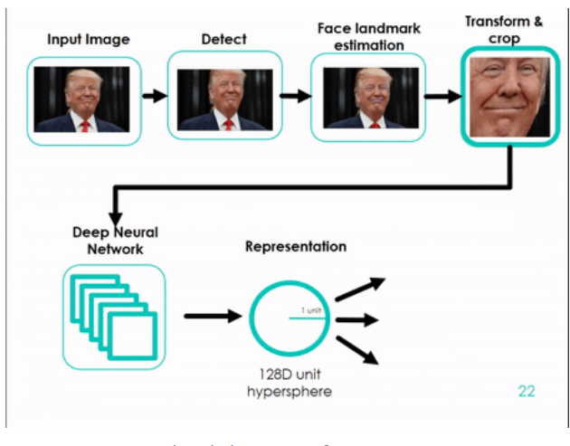
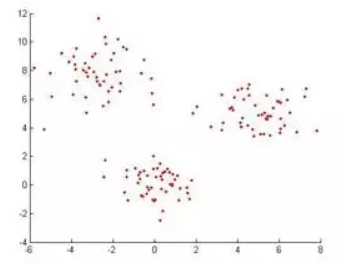
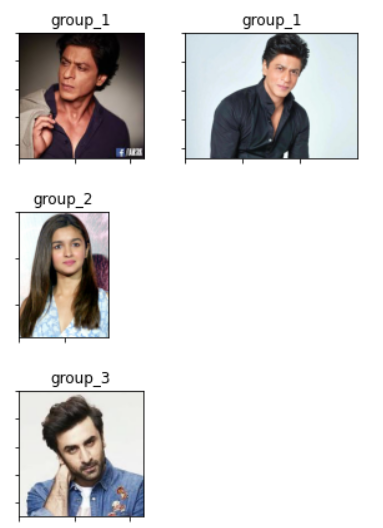
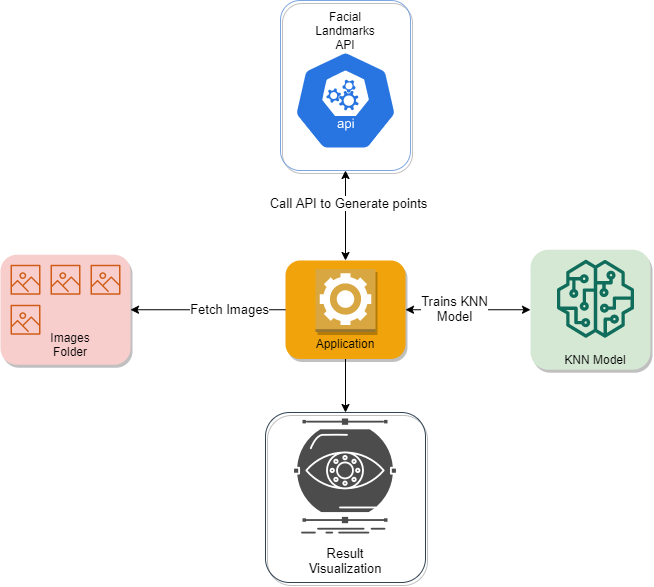

# Face Tagging

<p>The project tries to clone the functionality of a Google Images Feature that automatically groups images of people.</p>

## Team Members
[Gagandeep Singh](https://github.com/gaganmanku96)<br>
> Worked to combining all different parts together.

[Sreenithi Sridharan](https://github.com/sreenithi)
> Developed on an optimzied algorithm to group similar faces together.

[Shatakshi Pachori](https://github.com/shat700)
> Worked on the visualization part to display all grouped images.

[Nilesh Bhosale](https://github.com/Bhosalenileshn)
> Added documentation and explanations in various parts of the code.

## How to run
### 1. Clone the repo
```
$ git clone https://github.com/gaganmanku96/Face-Tagging
$ cd Face-Tagging
```
### 2. Setup the Facical Landmark Encoding API (Optional)
> To be able to train model on new images you would need the API to work.

You can setup it by using any of the mentioned method
#### a) Docker
```
$ docker pull gaganmanku96/facial_landmarks_api
$ docker run -p 5000:5000 gaganmanku96/facial_landmarks_api
```
#### b) Docker Compose
```
$ docker-compose up
```
### 3. Run the application
```
$ jupyter notebook Main.ipynb
```
## Workflow
### 1. Facial Points Extraction
A pretrained Resnet Model is used to extract 128D facial landmark points.

### 2. Apply Algorithm
KNN algorithm is used to find the similar group.<br>
<br>
The process works in this manner.<br>
1. Train a KNN model on first image (128D landmark points).
2. Predict on rest of the images.
3. If any image falls in 0.5 of neighbourhood then they are similar faces.
4. Repeat the step until all the images are covered.
5. Display all the groups<br>

<br>




## Tech Stack Used
1. Docker (for API deployment)
2. Python
3. Libraries - dlib, OpenCV, matplotlib, sklearn